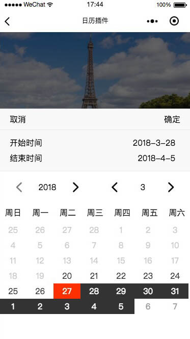

# 微信小程序 wepy-calendar-range 插件

## 说明
一个很小的日历选择插件



## 使用

### 安装组件
```
npm install wepy-calendar-range --save
```

### 引入组件
```javascript
// index.wpy
<template>
    <calendar class="calendar" :minDate.sync = "minDate" :startDay.sync = "startDay" :endDay.sync = "endDay" :period.sync = "period" :showPeriod = "showPeriod" :startDayText = "startDayText" :endDayText = "endDayText"></calendar>
</template>
<script>
    import wepy from 'wepy';
    import calendar from 'wepy-calendar-range';

    export default class Index extends wepy.page {
        data = {
          startDay: '2018-3-28', //开始时间
          endDay: '2018-4-5', //结束时间
          period: '', //选择周期
          minDate: '2018-3-20', //最小时间
        },
        components = {
            calendar: calendar
        };
    }
</script>
```


## 属性说明

| 属性/方法   | 必填    |  默认值  |备注|
| --------   | -----   | ---- |---- |
| startDay | 否      |   null |开始时间|
| endDay   | 否      |   null    |结束时间|
| period    | 否      |   null    |选择周期|
| minDate  | 否      |   null    |最小时间|
| showPeriod  | 否  | false  | 是否显示区间值  |
| startDayText  | 否  | 开始日期  |  开始显示文案 |
| endDayText  |  否 | 结束日期  |  结束显示文案 |


## 更多说明
现在还很初级，后续会不断完善
